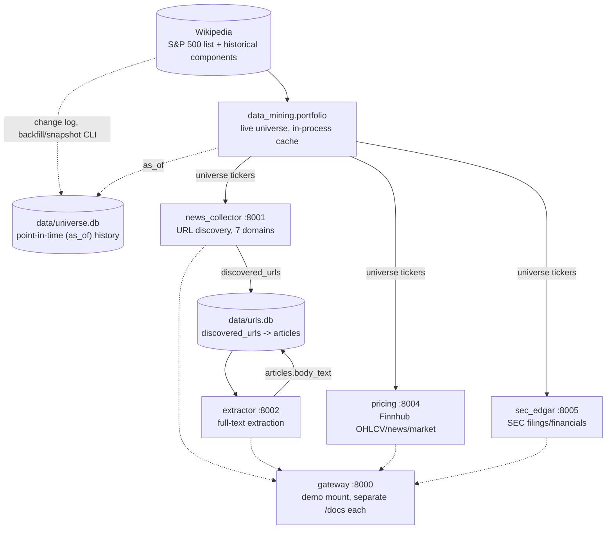

# SPEC.md — `portfolio-data-mining`

Part of the thesis *"Sistema inteligente para la optimización de la inversión
en portafolios mediante integración de información financiera estructurada y
no estructurada de acciones del S&P500"* — Gabriel Jaime Múnera González &
Dovaribi Carupia Yagari, Universidad Pontificia Bolivariana (UPB). Referred
to elsewhere in this document and the architecture artifacts by its working
nickname, "Portfolio Thesis."

The technical contract for this repository: requirements, architecture, data
model, and acceptance criteria. Where `.specify/memory/constitution.md` is
the philosophy/principles/code-style layer this repo commits to regardless of
feature, this document is the "what, precisely" layer for the system it
implements — every requirement below should be traceable to a test, and every
design decision should be explainable by a principle in the constitution.
Link liberally: a design choice justified by, e.g., the constitution's
Technological stock or AI behavior principles is annotated `(constitution: …)`
below rather than re-argued here.

Requirement IDs (`FR-0xx` functional, `NR-0xx` non-functional) are stable —
don't renumber an existing one, even if it's later superseded; mark it
superseded in place instead. Reference them in commits/PRs/tests
(`test_orchestrator.py::test_resume_skips_already_completed_pairs  # FR-001`)
so a reviewer can trace implementation back to requirement and requirement
back to test.

---

## 1. Overview & Purpose

`portfolio-data-mining` is the acquisition layer of a six-repository system
(the "Portfolio Thesis") that builds and maintains an S&P 500 portfolio on
top of a knowledge graph. Data flows in one direction through the system:

```
sources (Wikipedia/news/Finnhub/SEC EDGAR)
  → portfolio-data-mining      (THIS REPO — acquisition: discovers URLs, extracts article text, pulls pricing/filings)
  → portfolio-nlp              (semantic layer: sentiment/NER/category over articles.body_text)
  → portfolio-financial-analysis (fundamentals/pricing/cycle/quant → SEMANTIC score input)
  → portfolio-knowledge-graph   (RDF/OWL projection + SPARQL evidence surface)
  → portfolio-reports           (as-of run engine, per-name evidence, HTML report)
  → portfolio-app                (thin Streamlit client)
```

with one feedback edge running back up (a user-defined decision criterion,
compiled once in `reports` and propagated into `financial-analysis` and the
knowledge graph) — out of scope for this repo, noted here only for context.

**What this repo is for**: nothing downstream in the thesis has anything to
work with until raw source material exists somewhere durable and queryable.
`portfolio-data-mining` turns three independent public sources — financial-
news sites, Finnhub, and SEC EDGAR — into that durable material: discovered
article URLs and their full text (`discovered_urls`/`articles`, shared
SQLite), plus on-demand Finnhub OHLCV/news/market data and SEC filings/
financials served as plain HTTP JSON, all keyed off a tracked S&P 500
universe (live by default, with an opt-in point-in-time `as_of` overlay that
closes the survivorship-bias gap a live-only scrape would otherwise have).
Every downstream repo either reads this repo's `articles` table, reads its
`urls.db` read-only, or calls its `pricing`/`sec_edgar` HTTP services —
nothing downstream re-implements discovery, extraction, or provider access
itself.

**What this repo is explicitly not**: it does not run any NLP/ML model over
article text (`portfolio-nlp`'s job — this repo's output is raw provider
data, not a judgment about it); it does not aggregate results across assets
or time into portfolio-level signals (`financial-analysis` and
`knowledge-graph`'s job); it makes no portfolio or trading decision.

## 2. Scope & Requirements

### 2.1 In scope

- URL discovery for the tracked S&P 500 universe across seven financial-news
  domains, persisted to a durable, resumable SQLite queue.
- Full-text extraction from discovered URLs into a shared `articles` table.
- Two independent, stateless per-ticker HTTP pulls: Finnhub OHLCV/company
  news/market data/sentiment/profile/peers/basic financials (`pricing`), and
  SEC EDGAR filings/parsed financials (`sec_edgar`).
- The tracked S&P 500 universe itself: a live, in-process-cached Wikipedia
  scrape by default, plus an opt-in point-in-time (`as_of`) reconstruction
  from Wikipedia's historical-components change log.
- Four independently-runnable FastAPI services (one per stage/pull) plus one
  convenience gateway that mounts all four for local browsing/demo use.
- The shared connection/schema layer (`data_mining/`) and the
  `portfolio-common` DB engine it's built on.

### 2.2 Out of scope

- Any NLP/ML judgment over article text — sentiment, entities, category,
  summarization (`portfolio-nlp`).
- Cross-asset or cross-time aggregation of this repo's output into a
  portfolio signal (`portfolio-financial-analysis`, `portfolio-knowledge-
  graph`).
- Any UI (`portfolio-app`) or report rendering (`portfolio-reports`).
- The GDELT collector, Google-News collector, and generic web crawler the
  pre-`finhub` monolith once had — superseded by `news_collector`/
  `extractor` and deliberately not resurrected.
- A scheduler/orchestrator for the collector → extractor cadence, or for
  universe backfill/snapshot — both are explicit, manually-run commands
  today, by design at this project's current scope.
- A second database engine implementation — the `Dialect` seam exists
  (`portfolio-common` v1.2.1) but SQLite is the only backend actually built.

### 2.3 Functional requirements

| ID | Requirement | Acceptance criteria |
|---|---|---|
| **FR-001** | `news_collector` discovers article URLs for the tracked universe across seven domains (CNBC, Yahoo Finance, Financial Times, Investing.com, Nasdaq, Seeking Alpha, StockTwits) over `$DISCOVERY_START_DATE`–`$DISCOVERY_END_DATE`, writing each to `discovered_urls`, and is resumable per `(ticker, domain)` pair. | Running `discover` twice on unchanged input produces no duplicate `discovered_urls` rows; `--resume` (default on) skips only a `(ticker, domain)` pair with an exact-range `discovery_progress` row already recorded; `/discovery/stats` reflects the resulting counts. |
| **FR-002** | `extractor` reads pending `discovered_urls` rows and writes full-text extraction results to `articles` (same `id`, `FOREIGN KEY`-linked), including `body_text`. | After `extract/run`, every previously-pending URL has a corresponding `articles` row; re-running does not reprocess a URL already extracted unless explicitly reset (`discovered/{url_id}/reset`). |
| **FR-003** | `pricing` exposes Finnhub OHLCV, company news, market news, news-sentiment, company profile, peers, and basic financials per ticker over HTTP, writing nothing to any database. | Every public method returns `{"success": True, "data": ...}` or `{"success": False, "error": "<message>"}` (constitution: AI behavior #3) — never a raised exception reaching the caller, never a bare `None`. |
| **FR-004** | `sec_edgar` exposes company info, filings (optionally filtered by form type), years-available, filing-by-year, latest-filing, parsed financials, and full-text filing search per ticker over HTTP, writing nothing to any database. | Same response-shape contract as FR-003; a blank/invalid ticker returns `{"success": False, "error": ...}` rather than raising (regression-tested: `test_get_company_info_rejects_blank_ticker`). |
| **FR-005** | `data_mining.portfolio` provides the tracked S&P 500 universe — a live Wikipedia scrape, cached in-process — consumed identically by `news_collector`/`extractor` discovery and `pricing`'s `/universe` routes. | `list_universe()`/`resolve_symbol()` and `GET /universe`, `GET /universe/resolve/{query}` return current membership with `as_of` omitted, with no database read. |
| **FR-006** | `data_mining.universe_history` reconstructs point-in-time S&P 500 membership from Wikipedia's "Historical components" change log into a dedicated `data/universe.db` (`$UNIVERSE_DB_PATH`), exposed via an optional `as_of` date on `list_universe()`/`resolve_symbol()` and the `/universe` routes; populated by the explicit `universe-backfill` (one-time) and `universe-snapshot` (periodic) CLI subcommands. | `universe-backfill` populates `data/universe.db` from scratch on an empty file; a query with `as_of` set before a given ticker's recorded addition date excludes that ticker (closing the survivorship-bias gap the live-only path has). |
| **FR-007** | A newly-added S&P 500 member is fully backfilled with zero special-casing: `discover` with neither `--tickers` nor `--sp500` always re-fetches the *live* full universe and requests the *full* configured date range every run; `--resume` only skips a pair with an exact-range checkpoint already on file. | A ticker with zero `discovery_progress` rows gets the full configured range processed on the very next `discover` run — same code path every other ticker's first run took, documented in `docs/modules/news-collector.md`, no `is_new_ticker` branch anywhere. |
| **FR-008** | Both pipeline stages open `data/urls.db` exclusively through the shared `data_mining.db.connect()` factory (`news_collector` with `wal=True`, `extractor` with `foreign_keys=True`), and create/upgrade schema via `data_mining.schema`'s `apply_schema()`/migration helpers — the canonical DDL lives in that one module. | `grep` for a second schema-creation call site (`create_schema`/`executescript` equivalent) outside `data_mining/schema.py` returns none; either stage can bootstrap a fresh, empty `$DATABASE_URL` path correctly on first run. |
| **FR-009** | Dynamic SQL sized to a caller-supplied list (an `IN (...)` clause) or picking a caller-supplied sort column (an `ORDER BY` allowlist) goes through `portfolio_common.db.in_clause()`/`Allowlist`, not hand-rolled string interpolation. | `grep` for an f-string/`.format()`-built `IN (` or `ORDER BY` in `news_collector/storage/queue.py` or `extractor/db.py` returns none outside these helpers. |
| **FR-010** | `apps/gateway.py` mounts all four services under one process (`/collector`, `/crawler`, `/pricing`, `/edgar`) for local convenience, without merging their OpenAPI schemas. | `GET /collector/docs`, `/crawler/docs`, `/pricing/docs`, `/edgar/docs` each serve that service's own schema; there is no single merged `/docs`. Production/independent-scaling deploys run the four standalone `apps/*_api.py` instead. |
| **FR-011** | `cli/*.py` mirrors each service's API routes 1:1 as argparse subcommands and prints JSON to stdout. | Every non-infrastructure route (excluding `/health`, `/docs`) in `pricing_api.py`/`sec_edgar_api.py` has a corresponding `cli/pricing_cli.py`/`cli/sec_edgar_cli.py` subcommand; `news_collector_cli.py`/`news_crawler_cli.py` wrap each module's pre-existing CLI rather than reimplementing it. |

### 2.4 Non-functional requirements

| ID | Requirement | Acceptance criteria |
|---|---|---|
| **NR-001** | None of the four services has authentication or authorization — every endpoint is open to anyone who can reach the port. | Acceptable today only because every service is expected to run on a private/trusted network with a single operator, not because it's been assessed as safe for broader exposure (§14). |
| **NR-002** | SQLite is the only implemented database engine; a second backend is a `portfolio-common` `Dialect` implementation plus a re-pin here, never a repo-local shim. | `grep -rn "import sqlite3" src apps cli` returns nothing outside test fixtures (verified after `portfolio-common` v1.2.1's engine-agnostic seam, PR #26); a prior repo-local shim attempt (`db_backend.py`, PR #12, Turso/libSQL) was closed unmerged rather than adopted, precisely because the sanctioned path is the `Dialect` seam. |
| **NR-003** | The shared connection applies `PRAGMA foreign_keys`/`busy_timeout=30000` per-connection (WAL persists at the file level) — a connection finding `urls.db` locked by another writer retries internally rather than immediately raising. | A concurrent `extractor` read and `news_collector` write against the same `urls.db` does not surface `sqlite3.OperationalError: database is locked` under normal single-writer contention. |
| **NR-004** | The test suite requires no live network access to Finnhub/SEC EDGAR/Wikipedia/any news domain and no GPU. | `uv run pytest` passes with every external boundary mocked (`respx` for HTTP, monkeypatched `finnhub.Client`/`edgar.Company`, `hypothesis` property tests for queueing logic) — 213 tests across `tests/{news_collector,extractor,pricing,sec_edgar,data_mining}`. |
| **NR-005** | One pre-existing platform-specific test flake is documented, not silently tolerated or hidden. | `tests/news_collector::test_enqueue_inserts_at_most_len_input` is a known Windows-only flake (a `hypothesis` property test racing temp-SQLite-file cleanup against an open connection) — recorded in `CLAUDE.md` and `docs/modules/news-collector.md` as not a logic bug, so it isn't mistaken for a regression. |
| **NR-006** | A database-engine change away from SQLite must not require touching this repo's stage/query logic. | `grep -rn "import sqlite3" src apps cli` returns nothing (NR-002); every engine-specific SQL fragment goes through `conn.dialect`/`portfolio_common.db` helpers rather than a raw driver call. |
| **NR-007** | There is no CI workflow configured for this repo — lint/format/type/test gating before merge is a manual, convention-based step (constitution: Executable cmds #1), not an automated one. | `.github/workflows/` does not exist in this repo as of this writing; see `PLAN.md` for whether adding one is the actionable next step. |

## 3. Technology Stack & Architecture Decisions

Full stack and rationale: `.specify/memory/constitution.md` §Technological
stock. Summary for traceability:

- **Runtime**: Python `>=3.12,<3.13`, `uv`-managed (`uv.lock` committed).
- **Serving**: FastAPI (`==0.141.1`) + `uvicorn` (`==0.52.1`) across four
  independent services, `httpx[http2]` for outbound calls.
- **Storage**: SQLite, accessed exclusively through `portfolio_common.db`'s
  `Database`/`Dialect` seam (git-tag-pinned `portfolio-common @ v1.2.1`) — no
  raw `sqlite3` anywhere in non-test `src`/`apps`/`cli` (NR-002/NR-006).
- **Per-service libraries**: `ddgs`/`yfinance`/`tenacity`/`feedparser`/`lxml`
  (`news_collector`); `beautifulsoup4`/`trafilatura`/`langdetect`
  (`extractor`); `finnhub-python` (`pricing`); `edgartools`/`defusedxml`
  (`sec_edgar`) — each scoped to the one service that needs it.

Architecture decisions this repo has already made and should not be
re-litigated without a constitution amendment:

- **The DB layer is vendored, not a dependency.** `src/data_mining/` owns
  the `urls.db` connection factory, canonical schema, and the S&P 500
  universe loader directly; `portfolio-common` supplies only the engine-
  agnostic `Database`/`Dialect`/`in_clause`/`Allowlist` primitives
  underneath it. (History: this code moved out of `portfolio-common` in its
  clean-break v1.0.0 rewrite, since this repo was confirmed as its only
  consumer — `docs/portfolio-common-v1-migration-plan.md`.)
- **`news_collector` and `extractor` share one physical database**, not a
  two-tier source/results split — they are sequential stages of the same
  pipeline (discovery writes `discovered_urls`, extraction reads it and
  writes `articles`), not independent producers needing isolation from each
  other.
- **`pricing` and `sec_edgar` are stateless, not persistence layers.** Every
  public method is a live per-ticker pull with zero database writes,
  deliberately, so replacing or independently scaling either service never
  touches `urls.db` or any other pipeline state.
- **Universe membership is live-first, with a fully separate opt-in
  history overlay.** `data_mining.portfolio`'s default behavior (`as_of`
  omitted) is a live scrape with an in-process cache — no DB, no history.
  Point-in-time membership lives in `data_mining.universe_history`, backed
  by its *own* SQLite file (`data/universe.db`), deliberately not the shared
  `urls.db` — so `pricing`'s zero-pipeline-DB-dependency property (FR-005)
  holds regardless of whether `as_of` is used.

## 4. System Architecture



**Reading this diagram**: solid arrows are the always-on chain (universe →
discovery → extraction, writing into one shared `urls.db`); `pricing` and
`sec_edgar` hang off the same universe but write nothing into any database —
they serve stateless per-ticker HTTP responses. The dashed `as_of` overlay is
opt-in and lives in a physically separate file (`data/universe.db`) so
`pricing`'s zero-pipeline-DB-dependency property holds either way. The
gateway (dashed) is a convenience mount, not part of the data flow itself.

Full detail, with hover tooltips per component: [the repository
artifact](https://claude.ai/code/artifact/85dbb7eb-d561-4be7-9639-adca66089f49)
referenced from `CLAUDE.md`. System-level placement of this repo among the
other five: [the architecture
overview](https://claude.ai/code/artifact/d3865a63-2894-4e20-b38a-7e50cf0d4040).

## 5. Data Model

Canonical DDL: `src/data_mining/schema.py` (`apply_schema` / migration
helpers). `discovered_urls` and `articles` share the same `id` (a
`FOREIGN KEY`-linked pair, not a join key needing re-matching on URL string).

| Table | Key | Notable columns | Written by |
|---|---|---|---|
| `discovered_urls` | `id` (PK, autoincrement) | `ticker`, `domain`/`source_domain`, `url`, discovery metadata | `news_collector` |
| `discovery_progress` | `(ticker, domain, date-range)` | completion checkpoint per pair — what makes `--resume` (FR-001/FR-007) possible | `news_collector` |
| `articles` | `id` (PK, `FOREIGN KEY` → `discovered_urls.id`) | `body_text`, `title`, `fetch_status`, `http_status_code`, `ticker`, `company`, `gics_sector`, `gics_sub_industry`, `pub_date`, `fetched_at`, `author`, `word_count`, `source_domain` | `extractor` |

**The `articles` column contract is a cross-repo dependency.** The columns
listed above are exactly what `portfolio-nlp` reads as its read-only SOURCE
(`docs/portfolio-common-v1.2-engine-agnostic.md`) — a rename or removal here
is a breaking change to that repo's contract, not just an internal refactor;
treat it with the same care as a public API change.

`pricing` and `sec_edgar` persist nothing — every response is composed
live from a Finnhub/EDGAR call and returned, never written to a table
(§3, response-shape convention FR-003/FR-004).

`data/universe.db` (`data_mining.universe_history`) holds the reconstructed
point-in-time S&P 500 membership change log; its schema is internal to that
module (see `src/data_mining/universe_history.py` for the exact shape) and
is not read by any other repo directly — access is always through
`list_universe(as_of=...)`/`resolve_symbol(as_of=...)` or the `/universe`
HTTP routes, never the file itself.

## 6. Core Workflows

**Discovery → extraction** (`cli/news_collector_cli.py discover` then
`cli/news_crawler_cli.py`, or the equivalent API routes):

1. `discover` fetches the live S&P 500 universe (or `--tickers`), fans out
   across the seven domains via connector-per-domain strategies (sitemap
   crawl or DuckDuckGo search, picked per domain), and writes new
   `discovered_urls` rows, skipping any `(ticker, domain)` pair whose exact
   date range is already checkpointed in `discovery_progress` (FR-001/007).
2. `extract/run` (or `news_crawler_cli.py`) reads pending `discovered_urls`
   rows, fetches and extracts full text via `trafilatura`, and writes one
   `articles` row per URL, `id`-linked back to its source row (FR-002).

**Independent pricing/filings pull** (no shared state with the above): a
caller (human via CLI, or `portfolio-financial-analysis` via HTTP) requests
`pricing_cli.py pricing <ticker> --start … --end …` or
`sec_edgar_cli.py filings <ticker> --form 10-K`; the service makes a live
Finnhub/EDGAR call and returns `{"success": ..., "data"/"error": ...}`
(FR-003/FR-004) — nothing is persisted.

**Universe maintenance** (manual, no scheduler — §13): run
`universe-backfill` once to reconstruct history into `data/universe.db`;
run `universe-snapshot` occasionally by hand to keep it current (FR-006).
After a snapshot reports an `added` ticker, re-running `discover` with
default arguments backfills that ticker's full news history automatically
(FR-007) — no separate "new ticker" step exists or is needed.

**Demo browsing**: `apps/gateway.py` mounts all four services' routers under
one process (`/collector`, `/crawler`, `/pricing`, `/edgar`) for local
convenience; each keeps its own `/docs` (FR-010).

## 7. Business Logic & Algorithms

- **Connector-per-domain discovery**: one class per news source
  (`src/news_collector/connectors/`), each paired with one of two discovery
  strategies (`src/news_collector/strategies/`) — sitemap crawling or
  DuckDuckGo search — chosen per domain based on what that site actually
  exposes.
- **Orchestrated, checkpointed fan-out**: `src/news_collector/orchestrator.py`
  fans discovery out across the ticker × domain matrix and records a
  `discovery_progress` row per completed `(ticker, domain, date-range)`
  triple — the mechanism both `--resume` (FR-001) and the new-member
  backfill (FR-007) rely on.
- **Full-text extraction**: `extractor` fetches each pending URL and runs
  `trafilatura`-based content extraction (with `langdetect` for language
  detection and `beautifulsoup4` for HTML fallbacks) into `body_text`.
- **Mutable-universe handling is a non-issue by construction, not a special
  case**: because `discover`'s default invocation always re-fetches the
  *live* universe and requests the *full* configured range, a ticker that
  joins the S&P 500 mid-project is treated identically to every ticker that
  was already tracked on day one — no `is_new_ticker` branch exists anywhere
  in the codebase (FR-007, mirrors the same pattern
  `portfolio-financial-analysis`'s `pricing_agent`/`fundamental_agent` use
  for the identical problem).
- **Response-shape convention as the sole error-handling contract for HTTP
  callers**: every `pricing`/`sec_edgar` public method (§3) catches its own
  upstream failure and returns an inspectable dict rather than propagating —
  callers branch on `result["success"]`, never wrap the call in `try/except`
  against a provider-specific exception type.

## 8. Error Handling & Resilience

Governing principle: fail as an inspectable result for HTTP callers, fail
loudly (never silently) for pipeline stages (constitution: AI behavior
#2/#3). Concretely in this repo:

- `pricing`/`sec_edgar` never let a Finnhub/EDGAR-specific exception escape
  a public method — every failure becomes `{"success": False, "error":
  "<message>"}` (FR-003/FR-004), so a caller never needs provider-specific
  exception handling.
- SQLite contention between `news_collector` (writer) and `extractor`
  (reader, and occasional writer) is handled by `busy_timeout=30000` — a
  connection retries internally for up to 30s before raising
  `sqlite3.OperationalError: database is locked`, rather than surfacing
  contention as an immediate hard failure (NR-003).
- `extractor` enables `PRAGMA foreign_keys = ON` on its connection, so an
  `articles` row can't be written for a `discovered_urls.id` that doesn't
  exist — a data-integrity guarantee enforced at the SQLite level, not just
  in application code.
- `discovery_progress`'s checkpoint-per-pair design (§7) means a partial or
  interrupted `discover` run loses at most the in-flight `(ticker, domain)`
  pair on resume — not the whole run.

## 9. Performance & Scalability Expectations

This repo has no throughput/latency SLA, and defining one is out of scope
(§14) — a real-time or high-volume performance target belongs to a
production system this project isn't. What exists instead:

- **Single-writer SQLite is an accepted current characteristic**, not an
  unaddressed defect: WAL mode (`URLQueue.initialize()`) allows one writer
  plus concurrent readers, which is sufficient at this project's corpus
  scale.
- **A DB-engine swap is feasible but not built**: `portfolio-common` v1.2.1
  added the `Dialect`/`connect_url` seam specifically so a real swap is a
  new `Dialect` implementation plus a re-pin here (constitution:
  Technological stock #4), not a rewrite of this repo's stage logic — but no
  second backend is implemented today (NR-002).
- **A prior migration attempt is recorded, not forgotten**: [PR
  #12](https://github.com/gamug/portfolio-data-mining/pull/12) built a
  repo-local `db_backend.py` shim and successfully migrated a live
  ~18.6M-row database to Turso/libSQL in testing, but was closed unmerged on
  2026-08-27 — a deliberate call not to bring that dependency in via a
  bespoke shim, not an abandoned or forgotten branch (§13).

## 10. Testing Strategy & Acceptance Criteria

- **Hermetic by construction** (NR-004): every external boundary — Finnhub,
  SEC EDGAR, Wikipedia, the seven news domains, DuckDuckGo search — is
  mocked (`respx` for HTTP, monkeypatched `finnhub.Client`/`edgar.Company`,
  `hypothesis` property tests for queueing/parsing logic). No network, no
  GPU, in `uv run pytest`.
- **Coverage mapping**: `tests/news_collector/` (incl.
  `tests/news_collector/connectors/`) covers discovery/orchestration/queue
  logic (FR-001/007/009); `tests/extractor/` covers extraction and the
  `discovered_urls` → `articles` write path (FR-002/008); `tests/pricing/`
  (`test_fetcher.py`/`test_market_data.py`/`test_news.py`, 38 tests) and
  `tests/sec_edgar/test_agent.py` (34 tests) cover the response-shape
  contract (FR-003/004); `tests/data_mining/` covers the shared connection/
  schema factory and the universe loader (FR-005/006/008).
- **New requirement → new test first** (constitution: match existing
  structure, smallest change) — a change implementing or altering an FR/NR
  above should land with a test that references the requirement ID in a
  comment or test name.
- **Acceptance criteria in §2.3/§2.4 are the test spec** — each row should
  be directly expressible as one or more `pytest` assertions; a PR claiming
  to satisfy an FR/NR without a corresponding test is incomplete.
- **One documented, non-blocking flake**: `test_enqueue_inserts_at_most_
  len_input` (Windows-only, `tests/news_collector`) is a known race in a
  `hypothesis` property test's temp-file cleanup, not a logic bug (NR-005) —
  don't "fix" it by weakening the property it tests.
- **213 tests total** as of `portfolio-common` v1.2.1 adoption (PR #26),
  across the five `tests/<package>` directories above.

## 11. Deployment Procedures

There is no formal CD pipeline for this repo; what exists:

1. `uv sync` (installs the `dev` dependency group: pytest, pytest-asyncio,
   hypothesis, respx, pre-commit, ruff, mypy).
2. Configure `.env` from `.env.example`: `$FINNHUB_API_KEY` (required for
   `pricing`), `$NAME`/`$EMAIL` (required for `sec_edgar`, per SEC EDGAR's
   self-identification requirement), `$DATABASE_URL`/`$UNIVERSE_DB_PATH`
   (optional, default under `data/`), `$DISCOVERY_START_DATE`/
   `$DISCOVERY_END_DATE` (optional).
3. Run whichever service(s) are needed —
   `uv run apps/{news_collector,news_crawler,pricing,sec_edgar}_api.py`
   standalone, or `uv run apps/gateway.py` for local demo browsing of all
   four — and/or invoke the matching `cli/*_cli.py` on whatever cadence the
   batch stages (`discover`/`extract`) need (no scheduler is wired in — see
   §13).
4. **No automated merge gate exists today** (NR-007): `uv run ruff check .`
   → `uv run ruff format --check .` → `uv run mypy --config-file=
   .code_quality/mypy.ini src apps cli` → `uv run pytest` is a manual,
   convention-based sequence run locally before opening a PR, not enforced
   by a `.github/workflows/` CI job — see `PLAN.md`.

## 12. Dependencies & Integrations

- **External services (required)**: Finnhub API (`pricing`, needs
  `$FINNHUB_API_KEY`); SEC EDGAR via `edgartools` (`sec_edgar`, needs a real
  `$NAME`/`$EMAIL` identity per SEC's programmatic-access policy); Wikipedia
  (live S&P 500 list scrape, `data_mining.portfolio`, and the "Historical
  components" change log, `data_mining.universe_history`); the seven news
  domains + DuckDuckGo search (`news_collector`).
- **Upstream (library)**: `portfolio-common`, git-tag-pinned in
  `pyproject.toml` (`[tool.uv.sources]`, currently `tag = "v1.2.1"`) — a
  DB-engine-contract change here is an explicit, reviewed re-pin, never a
  floating version.
- **Downstream (consumers)**: `portfolio-nlp` reads `articles.body_text`
  from this repo's `urls.db` as its read-only SOURCE (§5);
  `portfolio-financial-analysis` reads `urls.db` read-only for shared-
  executive edges and calls this repo's `pricing`/`sec_edgar` services
  directly for scoring input.
- **No dependency on**: any repo downstream of `financial-analysis`
  (`knowledge-graph`, `reports`, `app` never call into this repo directly).

## 13. Open Questions & Risks

Carried forward from the last recorded architecture review
([the repository artifact](https://claude.ai/code/artifact/85dbb7eb-d561-4be7-9639-adca66089f49))
and this document's own drafting — resolve or explicitly accept before
treating a related FR/NR as done:

1. **No scheduler for the collector → extractor cadence.** Both stages run
   by hand today, with no "last successful run" marker beyond
   `discovery_progress`'s per-pair checkpoints — a full re-run schedule is
   left to whoever operates the pipeline.
2. **SQLite's single-writer/single-file model is an accepted current
   limitation, not yet a measured bottleneck** — the `Dialect` seam exists
   to swap it, but no second backend is implemented (§9/NR-002).
3. **Universe backfill/snapshot are manual, not scheduled** — `data/
   universe.db` is only as current as the last person who ran
   `universe-snapshot`; nothing enforces a cadence.
4. **No authentication on any of the four services** (NR-001) — acceptable
   only under the private/trusted-network, single-operator assumption this
   project currently operates under.
5. **No CI workflow file exists** (NR-007) — the lint/format/type/test gate
   is a human remembering to run it locally before a PR, not an automated
   check blocking a bad merge.
6. **Raw SQL in `apps/news_crawler_api.py` bypasses `extractor.db`'s named-
   query pattern** — documented as a known follow-up in
   `docs/portfolio-common-v1.2-engine-agnostic.md`, not yet done; a
   structural-refactor debt, not an engine-coupling issue (the app layer's
   raw SQL is still SQLite-flavored but harmless as long as it isn't part of
   an engine swap).
7. **`test_enqueue_inserts_at_most_len_input` is a known Windows-only flake**
   (NR-005) — open, tracked, not yet silenced or fixed, and shouldn't be
   "fixed" by weakening the property it's testing.
8. **The Turso/libSQL migration prototype (PR #12) was closed unmerged, not
   forgotten** — if SQLite ever does become a real bottleneck, the sanctioned
   path is a new `portfolio-common` `Dialect`, not resurrecting that PR's
   repo-local shim (§9).

## 14. Scope Boundaries (Out of Scope, Not Deferred)

**This repository is a thesis/research artifact. Productizing it is not a
goal of this project and no production phase is planned.** Every requirement
and acceptance criterion above (§2–§13) describes and governs that scope
honestly — nothing above should be read as an implicit production-readiness
claim. The items below are **permanently out of scope as this project is
currently defined**, not a backlog or a roadmap; they exist so a reader
doesn't mistake "not built" for "overlooked."

### What this stage validates

Per the design rationale in §7 and the workflows in §6, this repo currently
validates:

- **Feasibility** of a connector-per-domain discovery design across
  heterogeneous news sites (sitemap crawling vs. search, picked per domain).
- **Idempotency/resumability** of the discovery → extraction chain (FR-001/
  002/007), exercised by the hermetic test suite (§10).
- **A stable, uniform response contract** (`{"success": ..., "data"/"error":
  ...}`) across two otherwise-unrelated third-party providers (Finnhub, SEC
  EDGAR) — FR-003/004.
- **Structural correctness of the survivorship-bias fix**: `as_of` querying
  against `data_mining.universe_history` genuinely excludes a ticker before
  its recorded addition date (FR-006), not just a documented intention.

### What this project explicitly does not do (out of scope)

None of the following exist today, none are assumed by any FR/NR above, and
none are planned — this list is here so that absence reads as a deliberate
boundary of what this project is, not a gap someone forgot to close:

- **Access control**: there is no authentication or authorization on any of
  the four FastAPI services (§4/NR-001) — every endpoint is open to anyone
  who can reach that port. Today that's acceptable only because each service
  is expected to run on a private/trusted network with a single operator,
  not because it's been assessed as safe for broader exposure.
- **Operational tooling**: no monitoring/alerting, no on-call runbook, no
  documented disaster-recovery procedure for `urls.db`/`universe.db`, no
  scheduler for discovery/extraction or for universe backfill/snapshot
  (relates to §13 items 1/3).
- **A second database engine**: the `Dialect` seam is built, but SQLite is
  the only backend actually implemented (§9/NR-002) — this is a deliberate
  "seam ready, not yet needed" state, not an oversight.
- **Any of the four collectors the pre-`finhub` monolith once had beyond
  today's seven news domains** (GDELT, Google-News, a generic web crawler) —
  superseded before this repo existed in its current form and not planned
  for reintroduction.

### §13 items: disposition

| §13 item | Disposition | Would only matter if |
|---|---|---|
| 1 — no scheduler for collector → extractor | Accepted; manual cadence is sufficient at current usage | This scope changed to need the pipeline reliably current on a cadence |
| 2 — SQLite single-writer/single-file model | Accepted for current corpus scale; the `Dialect` seam exists if this changes | SQLite's write throughput or file-locking became a measured bottleneck |
| 3 — universe backfill/snapshot are manual | Accepted; same reasoning as item 1 | Universe drift between snapshots started causing missed tickers in practice |
| 4 — no authentication on any service | Accepted for a private/trusted-network, single-operator setup | These services were exposed beyond that trust boundary |
| 5 — no CI workflow file | Should fix regardless of scope — cheap, and closes a real gap between "convention" and "enforced" | — |
| 6 — raw SQL bypassing `extractor.db`'s query pattern | Accepted; already tracked as a follow-up in `docs/portfolio-common-v1.2-engine-agnostic.md` | A DB-engine swap ever needed every SQL fragment centralized, including this one |
| 7 — Windows-only `hypothesis` flake | Accepted as a known, non-blocking, platform-specific flake | It started failing on the actual CI/dev platform, not just Windows |
| 8 — Turso/libSQL prototype (PR #12) closed unmerged | Accepted; deliberate choice of the `Dialect` seam over a bespoke shim | — |

Item 5 is the one item on this list worth doing regardless of scope — it's
CI-plumbing, not new infrastructure, and it's the same category of "cheap,
should fix regardless of scope" item `portfolio-nlp`'s own SPEC.md identifies
for its own repo. Everything else here is a permanent characteristic of this
project as scoped, not a queued task.

## 15. Sign-off

This SPEC.md is the technical contract implementers, reviewers, and (per
`.specify/memory/constitution.md`'s AI behavior section) coding agents plan
against. A change that adds/removes a functional capability, alters an
acceptance criterion, or introduces a new external dependency should update
the relevant `FR-0xx`/`NR-0xx` entry (or add a new one) **in the same PR**
that implements it — not as a follow-up. A PR that contradicts this document
without amending it here first is out of spec; raise the conflict rather
than silently diverging (constitution: Governance).

| Role | Name | Date | Notes |
|---|---|---|---|
| Author | Gabriel Jaime Múnera González | | Universidad Pontificia Bolivariana (UPB) |
| Author | Dovaribi Carupia Yagari | | Universidad Pontificia Bolivariana (UPB) |
| Reviewer | Camilo Andrés Soto Montoya | | Universidad Pontificia Bolivariana (UPB) |

**Version**: 1.0.0 | **Last Amended**: 2026-09-12
