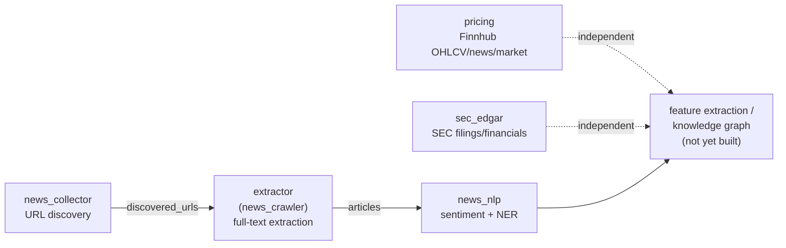

# portfolio-data-mining

A single repository for a financial-news + SEC-filings data-mining pipeline, consolidated
from four previously separate projects (`news-collector`, `news-crawler`, `news-nlp`,
`finhub`) into one `src/`, one `.env`, one venv, and one dependency set — while keeping
each stage independently runnable as its own FastAPI service.

## Pipeline



`news_collector` → `extractor` → `news_nlp` share one SQLite database
(`data/urls.db`, gitignored — regenerated by running the pipeline) via the
`discovered_urls` → `articles` → `article_sentiment`/`article_entities` tables. That path
is controlled by `$DATABASE_URL` (see `.env.example`) — unset, it defaults to
`data/urls.db`. It's still just a filesystem path today (this is plain SQLite, no
migration planned right now), but every one of the three modules' connection sites reads
it from the same env var rather than a hardcoded literal, so pointing it at a real
connection string later is a one-line env change, not a multi-file code change.
`pricing` and `sec_edgar` are independent of that chain — they pull directly from Finnhub
and SEC EDGAR for a given ticker, keyed off the tracked universe `common.portfolio`
fetches live from Wikipedia (same source `news_collector`/`extractor` use) and caches
in-process.

## `src/` — one folder per source project

| `src/` package | From | Module doc |
|---|---|---|
| `news_collector/` | `news-collector/news_collector/` | [docs/modules/news-collector.md](docs/modules/news-collector.md) |
| `extractor/` | `news-crawler/src/extractor/` | [docs/modules/news-crawler.md](docs/modules/news-crawler.md) |
| `news_nlp/` | `news-nlp/src/` | [docs/modules/news-nlp.md](docs/modules/news-nlp.md) |
| `pricing/` | `finhub/src/{trading,market,news}/` (finhub split #1) | [docs/modules/pricing.md](docs/modules/pricing.md) |
| `sec_edgar/` | `finhub/src/fundamental/` (finhub split #2) | [docs/modules/sec-edgar.md](docs/modules/sec-edgar.md) |
| `common/` | `finhub/src/{config,commons}/` | shared by `pricing` + `sec_edgar`: universe loader (`portfolio.py`), shared error type (`errors.py`) |

Each package kept its own project's internal import style wherever that didn't collide
with sharing one `src/` — `news_collector` and `extractor` are untouched (their absolute
imports already matched their own package name); `news_nlp`'s and `finhub`'s code used to
import from a package each of them called `src`, which would have collided with this
repo's shared `src/`, so those imports were rewritten (`from src.X` → `from news_nlp.X` /
`from common.X` / `from pricing.X` / `from sec_edgar.X`) — see each module doc's source
mapping for exactly what changed.

Every service gets its own thin entrypoint under `apps/` (FastAPI/uvicorn) and `cli/`
(argparse, runs the code directly — no server raised), both bootstrapping `src/` onto
`sys.path` so they run standalone with no `PYTHONPATH` setup:

| Service | `apps/` (server) | `cli/` (direct/batch) | Port |
|---|---|---|---|
| news_collector | `news_collector_api.py` | `news_collector_cli.py` | 8001 |
| extractor (news_crawler) | `news_crawler_api.py` (dev/test only) | `news_crawler_cli.py` | 8002 |
| news_nlp | `news_nlp_api.py` | `news_nlp_cli.py` | 8003 |
| pricing | `pricing_api.py` | `pricing_cli.py` | 8004 |
| sec_edgar | `sec_edgar_api.py` | `sec_edgar_cli.py` | 8005 |
| gateway — all five, one process, browsing/demo only | `gateway.py` | — | 8000 |

`cli/*.py` print JSON to stdout, one subcommand per underlying operation (mirroring that
service's API routes 1:1 where it has routes) — e.g.
`pricing_cli.py pricing AAPL --start 2024-01-01 --end 2024-06-01`,
`sec_edgar_cli.py filings AAPL --form 10-K`. `news_collector_cli.py` and `news_nlp_cli.py`
are thin wrappers around each module's own existing CLI
(`news_collector.main`'s discover/stats/export subcommands;
`news_nlp.pipeline.run_pipeline()`); `news_crawler_cli.py` is the batch extraction runner
(was `news-crawler/run_extraction.py`). `pricing_cli.py`/`sec_edgar_cli.py` are new —
`finhub` never had a CLI, only its FastAPI app.

`apps/gateway.py` mounts the other five under one port for convenience (`/collector`,
`/crawler`, `/nlp`, `/pricing`, `/edgar`) — each keeps its own separate `/docs`, this does
**not** merge them into a single OpenAPI schema. See
[docs/modules/gateway.md](docs/modules/gateway.md) for why, and for when to use it vs. the
five standalone apps (production/independent-scaling deploys should use the standalone
apps).

## Setup

```bash
python -m venv .venv
.venv\Scripts\activate

pip install -r requirements.txt
# news_nlp only — not in requirements.txt because the wheel depends on your CUDA version:
.venv\Scripts\python.exe -m pip install torch --index-url https://download.pytorch.org/whl/cu124

copy .env.example .env
# then fill in FINNHUB_API_KEY, NAME, EMAIL (see .env.example for what each is for)
```

Run any service from the repo root, e.g.:

```bash
.venv\Scripts\python.exe apps\pricing_api.py
```

## Testing

```bash
.venv\Scripts\python.exe -m pytest
```

Runs `tests/news_collector`, `tests/extractor`, and `tests/news_nlp` (the latter needs
torch installed — see [docs/modules/news-nlp.md](docs/modules/news-nlp.md); it's often
already present transitively, check `pip show torch` before assuming you need the extra
step). `pricing`/`sec_edgar` don't have a test suite yet (`finhub` didn't have one
either). Current status: 143/144 pass; one pre-existing Windows-only flake in
`news_collector` unrelated to this consolidation — see
[docs/modules/news-collector.md](docs/modules/news-collector.md).

## What didn't come along

The pre-`finhub` monolith this repo used to be (see git history before this
consolidation) also had GDELT and Google-News collectors and a generic web crawler
(`src/news/gdelt_collector.py`, `gnews_collector.py`, `src/news/scraping/`). Those were
already superseded by `news_collector`/`extractor` and dropped when `finhub` was
extracted from that monolith — this consolidation carries that decision forward rather
than resurrecting them. `news-nlp`'s `models/` directory (multi-GB checkpoints) isn't
vendored either — `news_nlp`'s FinBERT/SEC-BERT models are fetched into the local
Hugging Face cache by `python -m news_nlp.setup` (see
[docs/modules/news-nlp.md](docs/modules/news-nlp.md)) instead of being committed.

The four original project folders (`news-collector/`, `news-crawler/`, `news-nlp/`,
`finhub/`) still exist as siblings of this repo on disk, untouched, as a safety net during
the transition.
